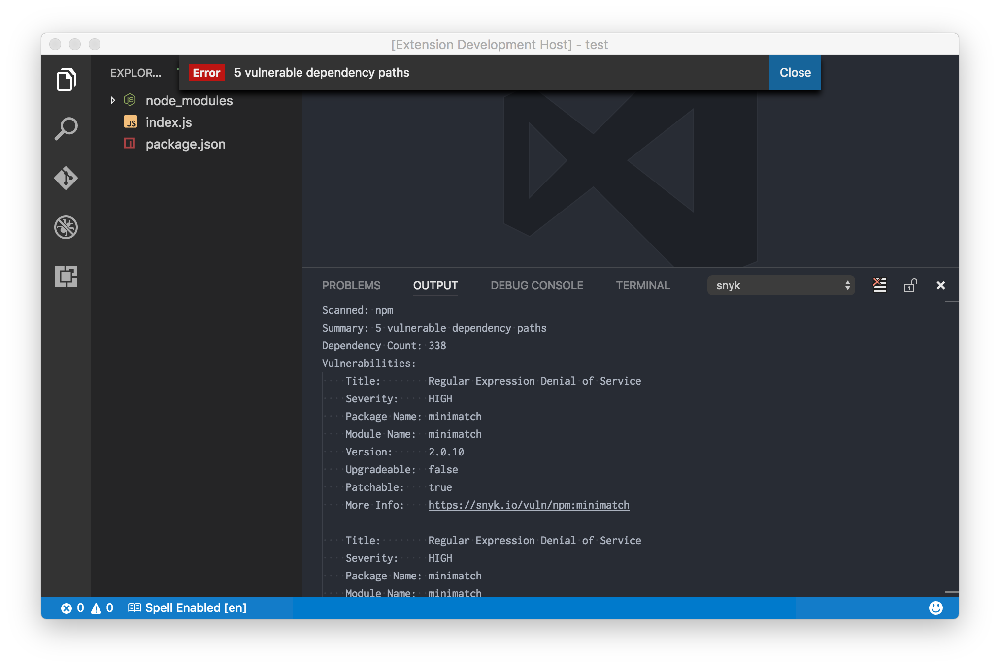
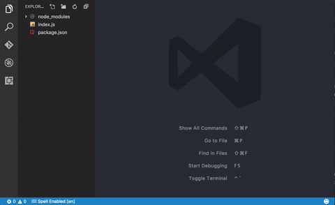
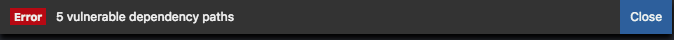
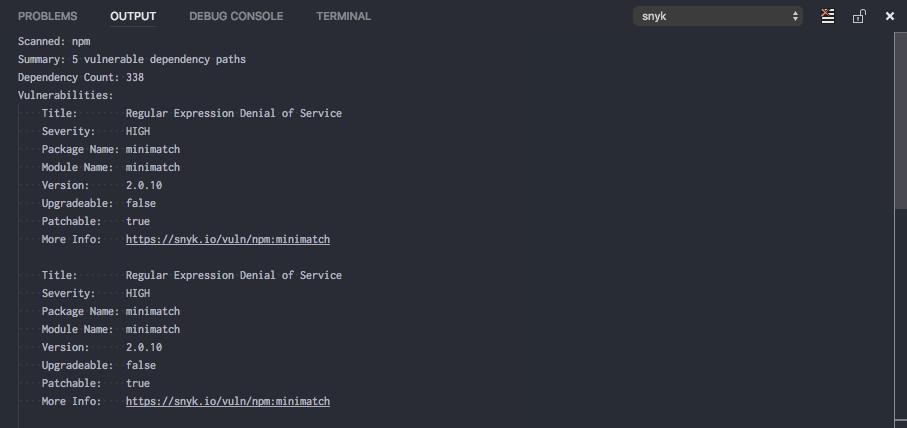

# vscode-snyk
> Visual Studio Code extension for Snyk.io

Check your Node.JS and Ruby dependencies against [Snyk.io](https://snyk.io/) vulnerability database.

Note: This extension requires internet access to [https://snyk.io/vuln/](https://snyk.io/vuln/) and will not currently work offline.

## Demo

## Usage

This extension adds the `Snyk Test` command to check your `package.json`, `npm-shrinkwrap`, or `Gemfile` against the Snyk.io VulnDB inventory of known vulnerabilities.

In the command palette (<kbd>CMD</kbd> + <kbd>SHIFT</kbd> + <kbd>P</kbd>), type `Snyk Test`.

## Features
- If vulnerabilities are found, display an error with a count of vulnerable dependencies
  
- If no vulnerabilities are found, display an info message
  
- Detailed summary of vulnerable dependencies
  
- Hyperlinked URLs directly to Snyk.io [VulnDB](https://snyk.io/vuln/) for more information on remediation.

## Release Notes

See [CHANGELOG.md](CHANGELOG.md).

### For more information

- [Snyk.io](https://snyk.io)
- [VulnDB](https://snyk.io/vuln/)
- [Docs](https://snyk.io/docs/)
